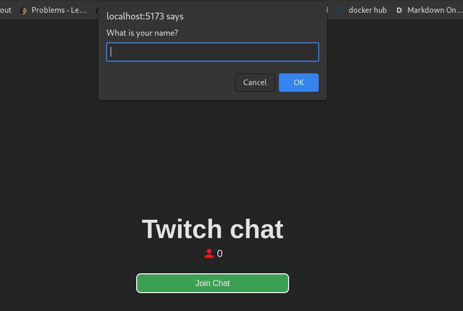

# How to run it

### 1. Open the terminal window and run `node ./dist/chatroom.js`
### 2. Open a second terminal window and run `cd chat-room && npm install && npm run dev`
### 3. Open your browser in localhost:5173 and enjoy!
### Tip: You could use an incognito browser to join the chat as a second client.

# Enter the chat by clicking the button

# Enter your name

# Chatting with two people real-time

# Kick command (only available to user **Elijahkx**)

# Closing the kicked client's connection after the command has been executed

